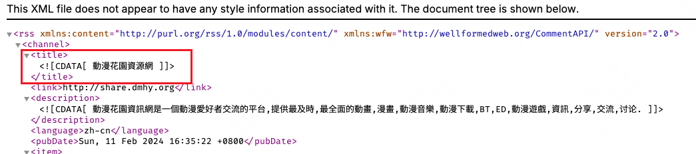
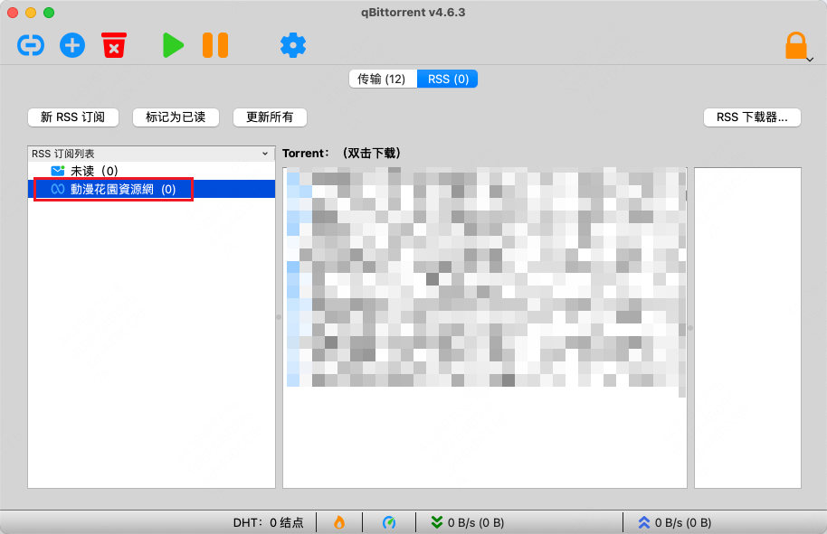
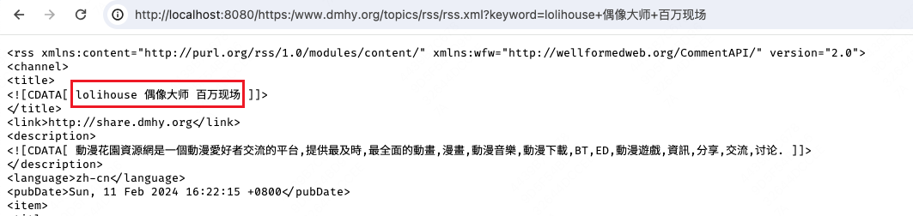
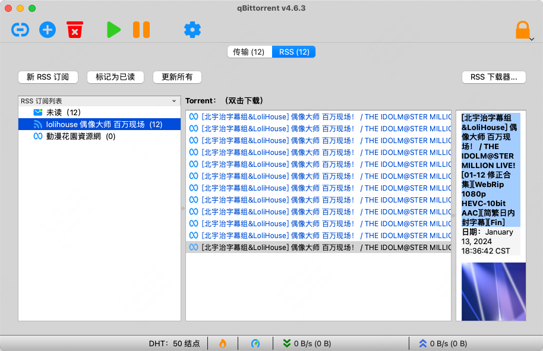

# rss-title-replace

Replace RSS title with search keywords, for `dmhy.org`, `acgnx.se`, etc.

## Description

Some sites(such as `dmhy.org`) provide RSS documents with a fixed title:



Which will be used in BT clients(such as `qBittorrent`) as an RSS subscription title:



Is inarticulate.

This simple tool will replace the fixed title with your query keywords, 
which will show you a more discernible title in BT clients:




## Usage

```bash
docker pull akise/rss-title-replace
docker run --name rss-title-replace -p 127.0.0.1:8080:8080 -d akise/rss-title-replace
```

## LICENSE

GPL-3.0
